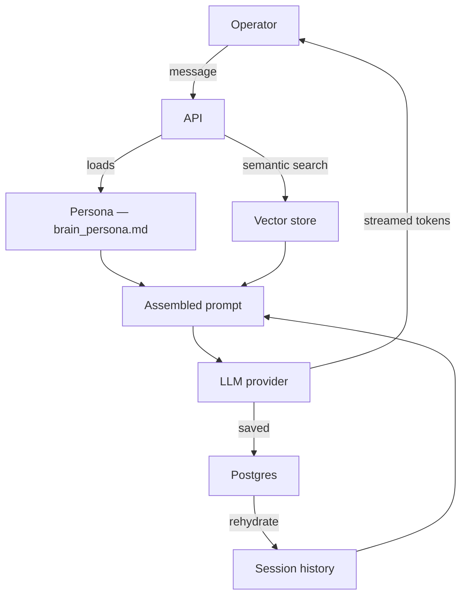
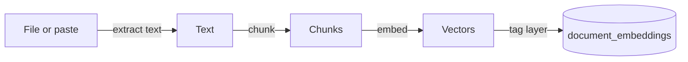
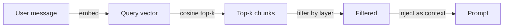

# How a brainfoundry brain thinks

*Created 2026-05-08. System map for brains provisioned from `brainfoundry-nous`.*

A brainfoundry brain is, mechanically, a chat-with-RAG sitting on top of an LLM. That's the boilerplate. What's actually distinct lives in five things — read those first; the standard parts are below as background.

## What's specific to brainfoundry

1. **You own it.** The brain runs on a server you control (or one provisioned for you that hands you the keys). Your sessions, documents, embeddings, federation keypair, and persona file live in *your* Postgres + your filesystem. There is no central platform that can suspend you, read your conversations, or change the rules.

2. **Persona as governance.** The system prompt for every chat is a file you edit (`api/brain_persona.md`). That file is the brain's behavioral charter — register, identity, what it refuses, what it defaults to. Updating the brain's behavior is editing markdown, not retraining a model. The schema at `registry/schema/brain/persona.schema.json` validates it on write.

3. **Layered memory.** Documents are tagged at upload with a layer (`public`, `private`, `episodic`, ...). Retrieval scopes which layers it sees per chat path. Public-chat is hard-coded to `layers=["public"]` — it cannot accidentally surface private documents even if the API tries.

4. **Federation.** Brains can DM each other over a signed protocol. Identity is an ED25519 keypair the operator owns; trusted peers live in `api/identity/known_peers.toml`. Two operators with brains can talk brain-to-brain without either platform-mediating the connection.

5. **Loop permits.** Mutating actions (consolidating a session into memory, federation send/receive, anything stateful) require a one-shot permit token. The audit trail makes "what was the brain doing on date X" answerable.

## Sovereignty — what's actually sovereign

Your data lives on your server. Your code lives on your server. Your federation keypair, persona, schemas, and session DB all live on your server.

Inference works two ways:

- **Local model** (ollama + llama or another open-weight model) — fully sovereign. Your prompt never leaves the box.
- **BYOK to a frontier model** (Anthropic, OpenAI, Groq, etc.) — your prompt leaves the box for that one turn. The model provider sees the prompt + retrieved context for that request. Data **at rest** stays yours; inference is hybrid.

The persona file is what your brain claims about its own sovereignty. Edit it to match your actual setup — saying "I run on llama3.2:1b" while you actually invoke Sonnet via BYOK is a lie the brain will tell on your behalf.

## The standard parts

A request flows like this:

### Ingestion

| Stage | What happens |
| --- | --- |
| Extract | PDF → text via PyPDF; .docx → python-docx; .md / .txt straight in |
| Chunk | Long text split into overlapping segments (~500 tokens by default) |
| Embed | Each chunk → vector via the embedding model in the api container |
| Tag layer | Each chunk gets a layer label (public/private/episodic/...) |
| Store | pgvector column in `document_embeddings` |

### Retrieval

The query is embedded in the same vector space as the documents. Cosine similarity ranks the top-k matches. Operator chat passes layers explicitly; public chat is locked to `["public"]`.

### Generation

The prompt the model sees is assembled in this order:

1. **System prompt** — the persona file
2. **Vendor-disavowal turn-prefix** — prepended only when the user message names a centralized AI vendor; forces the brain to disavow being that vendor (defense for small models that drift on identity)
3. **Retrieved documents** — top-k chunks from RAG
4. **Conversation history** — prior turns of this session
5. **The current user message**

The model's reply streams back as Server-Sent Events. Each token is appended to the assistant message in the UI; the full content is persisted to Postgres on stream close.

## Storage

| Component | Where | What |
| --- | --- | --- |
| Sessions | Postgres `chat_sessions` | session_id, title, created_at, model_name |
| Messages | Postgres `chat_messages` | session_id, role, content, created_at |
| Documents | Postgres `document_embeddings` | chunks, vectors, layer, document_name |
| Persona | `api/brain_persona.md` | system prompt — the brain's governance artifact |
| Federation peers | `api/identity/known_peers.toml` | trusted peer endpoints + pubkeys |
| Federation key | on-disk ED25519 keypair | brain identity for federation handshake |
| Identity | `api/brain_identity.yaml` | brain handle + non-secret identity metadata |

## Endpoint surface

All chat / data routes live on the API host (e.g. `<handle>.brainfoundry.ai`, no `console.` prefix). OpenAI-compatible request shape, so any client that talks to OpenAI talks to this brain by changing only endpoint and key.

| Route | Method | What |
| --- | --- | --- |
| `/health` | GET | Service health (db, ollama, embeddings) — public |
| `/identity` | GET | Brain handle + version + pubkey — public |
| `/chat/completions` | POST | Operator chat (OpenAI-compatible, streaming) — API key gated |
| `/v1/public/chat` | POST | Public chat — no key, per-IP rate limited, locked to public layer |
| `/sessions` | GET / POST | List + create chat sessions |
| `/sessions/{id}` | DELETE | Delete a session |
| `/sessions/{id}/title` | PUT | Rename a session |
| `/sessions/{id}/messages` | GET | Replay a saved session |
| `/chat/sessions/{id}/consolidate` | POST | Compact a chat into an episodic memory |
| `/documents/upload` | POST | Add a document to the vector store |
| `/v1/federation/assertion` | GET | Federation handshake — public |
| `/apps/list` | GET | Installed brain-app registry (built-ins + iframe-installable apps) |
